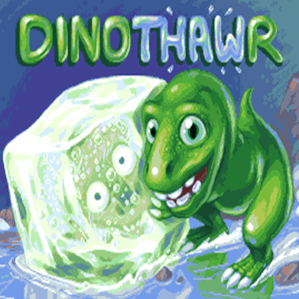

# Dinothawr

### Description

Dinothawr is a block-pushing puzzle game on slippery surfaces.

It is your task to free the dinosaur hero's friends from their ice prison.

### License

Non-commercial

### Icon

### Fanart

### Screenshots

